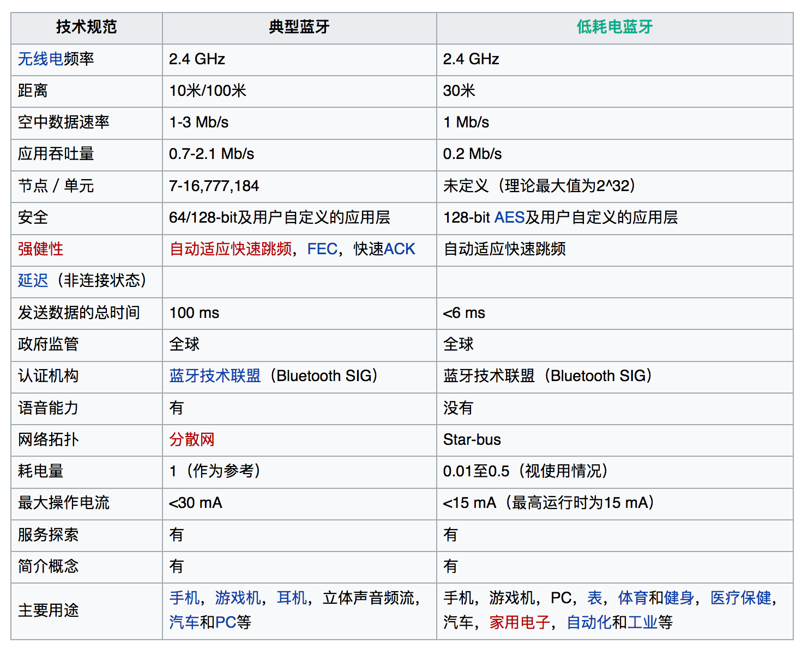

# Android 低功耗蓝牙(BLE)

## 0x00 BLE简介

[维基百科：低功耗蓝牙](https://zh.wikipedia.org/wiki/%E8%97%8D%E7%89%99#.E4.BD.8E.E8.80.97.E9.9B.BB.E8.97.8D.E7.89.99BLE.EF.BC.88Bluetooth_Low_Energy.EF.BC.89)

## 0x01 操作流程

前期流程和旧版本蓝牙相似，首先扫描设备，得到MAC地址之后进行连接，然后对其进行读写操作。

## 0x02 总结

参考
---
1、http://www.race604.com/android-ble-in-action/
2、http://witchiman.github.io/2016/04/05/BLE4-0/

