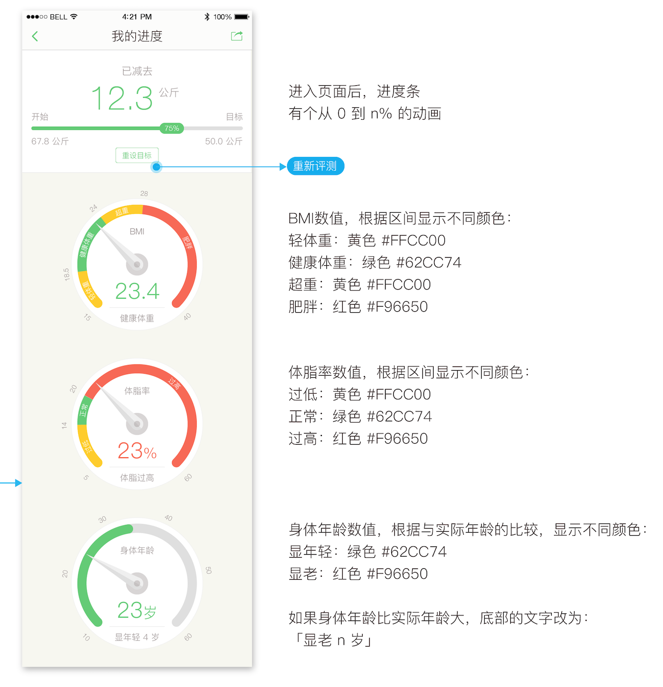

#   自定义View——IndicatorView

## 0x00 main

进步、创新都是在不断变化的需求中诞生的。
						－－ By ttdevs

这不，新的需求又来了。废话不多说，先上设计稿：



简单分析上图包括三部分：最上面的类Progressbar，中间两个指示盘和最下面的指示盘。第一个类Progressbar我们项目之前有实现过，但是和这个需求有一些差异，因此决定重新实现一遍。另外两个圆形指示盘本想通过在一张背景图片上放一张指针图，控制指针图的旋转来实现，但是考虑到这样不够灵活，因此也决定自己来画。So，我们接下来实现这三个View。

正式开始之前，先看看我们最终效果图（当然，指针是可以动的）：


## 0x01 分析

- LineIndicator （第一个，类Progressbar）

	主要包括三部分：左侧的提示和内容，右侧的提示和内容，中间的类Progressbar。两侧的文字比较容易处理，掌握了文字的基本绘制，画起来是很容易的。中间的类Progressbar由于打算自己画，所以不会直接贴个Progressbar在上面。我的思路是画一条长的直线作为背景，中间的指示也是直线，比背景直线粗，直线的Paint设置 `StrokeCap` 为 `Paint.Cap.ROUND` 即 `paint.setStrokeCap(Paint.Cap.ROUND);`，这样就可以有两头半圆的效果；中间的指示数字直接画在粗的指示直线上面即可。这里可能遇到的问题有下面两个：
	
	- `StrokeCap` 设置 为 `Paint.Cap.ROUND`时的位置关系
		
		`StrokeCap` 设置 为 `Paint.Cap.ROUND`，直线两侧的半圆是不算在直线的长度里的。简单来说，如果view的长度和我画的直线长度一致，那么这个直线就是矩形而不是期待的两侧都是半圆的椭圆。
		
	- 当进度为0或者为100％时的展示
		
		如果我们背景直线和指示直线起点终点位置一致，那么最终效果就是当进度为0或者100%的时候，指示直线是显示不全的，因此我们需要对这两个位置进行矫正。我的矫正方法比较简单，在0～x和y～100%进度的时候分别显示x和y（本以为自己的思路很屌，后来发现别人也是这么干的）。
	
- CircleIndicator （中间的多种颜色环）
	
	这个View我将其分解为四部分，从上层到下层：中间指针，刻度环，显示的内容，圆环背景和外层指示文字。每一部分再做分解：
	
	- 中间指针
		
		这个又分解为六个部分：最下层大圆，两个圆形半圆，两个三角形和上层小圆。
	
	- 刻度环
	
		由于是圆环，所以必须画弧线了。但是这个弧线又有点特殊，两侧带圆角，中间圆环直角，这个没想到啥好办法，用了很一般的思路：先用 `Paint.Cap.ROUND` 画两侧的弧，然后 `Paint.Style.STROKE` 画中间的部分。
	
	- 显示的内容
	
		这个就比较简单了，主要在于计算文字的显示位置。
	
	- 圆环背景和外层文字
	
		最简单的一个圆，加一个以圆为路径画的文字。
	

	最后我们画的顺序正好与上面所述顺序相反。
	
- ProgressIndicator （最下面的两种颜色环）
	
	这个相较 CircleIndicator 就简单了一些。在画圆环的时候，我们只需要先画一个灰色背景，然后再画一个绿色圆弧即可。
	

## 0x02 实现

View的绘制我们应该都比较熟悉，主要有下面三个过程： onMeasure（测量）、onLayout（布局）、onDraw（绘制）。针对上述三个View：LineIndicator，我们根据实际的内容来计算View的高度，宽度用户设定；CircleIndicator和ProgressIndicator的宽度用户设定，高度自定计算与宽度相同。onLayout我们不需要。最后的根据实际的展示内容来绘制。

另外，由于CircleIndicator和ProgressIndicator和相似度高，很多代码可以拿来重用，因此，我写了一个基类来完成公共的部分，特殊部分每个 子类自己完成。最后再子类地onDraw方法中按照顺序调用即可。

由于主要是计算各种坐标位置，代码还是不少的，这里就不贴代码。最后的实现请移步我的 [github](https://github.com/ttdevs/android/tree/master/modules/indicator)。三个View的代码已经整理完LineIndicator，其它的两个还需要点时间（2016-06-19）。

## 0x03 知识点

- 自定义View的思路

	- 创建类，继承自View或者ViewGroup或者其它ViewGroup
	- 定义View的可配置参数，如果你需要的话
	- 实现View的具体逻辑
	
	这个太粗略了，各位可以参考具体源码。
	
- 文字位置的计算

	如果你没有自己画过文字，那你肯定不可能一下子明白文字的画法，或多或少的出现偏移。这里直接给大家推荐一篇讲的非常详细的文章：http://blog.csdn.net/aigestudio/article/details/41447349

- 位置、半径、弧长等的计算

	这里会涉及到简单的三角函数和圆的周长弧度的计算，可能要说的就是三角函数的参数是弧度制度。
	
- ObjectAnimator

	``` java
    /**
     * 设置内容的颜色值（非resource的id）
     *
     * @param contentColor 内容的颜色值
     * @param unitColor    单位的颜色值
     */
    public void setContentColor(int contentColor, int unitColor) {
        mContentColor = contentColor;
        mUnitColor = unitColor;
    }

    /**
     * 设置进度
     *
     * @param indicator 进度值
     */
    public void setIndicator(float indicator) {
        if (indicator <= mStartIndicator) {
            mIndicator = mStartIndicator;
        } else if (indicator > mEndIndicator) {
            mIndicator = mEndIndicator;
        } else {
            mIndicator = indicator;
        }
        postInvalidate();
    }

    /**
     * 获取进度
     *
     * @return 当前进度值
     */
    public float getIndicator() {
        return mStartIndicator;
    }

    public void animateIndicator(float indicator) {
        Interpolator interpolator = new AnticipateOvershootInterpolator(1.8f);
        ObjectAnimator animation = ObjectAnimator.ofFloat(this, "indicator", indicator);
        animation.setDuration(2000);
        animation.setInterpolator(interpolator);
        animation.start();
    }
	```

- 处理屏幕的旋转

	由于时间比较紧，这个我还没做。主要在View的以下两个方法中实现：
	
	``` java
	
   @Override
    protected Parcelable onSaveInstanceState() {
        return super.onSaveInstanceState();
    }

    @Override
    protected void onRestoreInstanceState(Parcelable state) {
        super.onRestoreInstanceState(state);
    }

	```
	
最后欢迎各位吐槽并提供更好的建议～～


